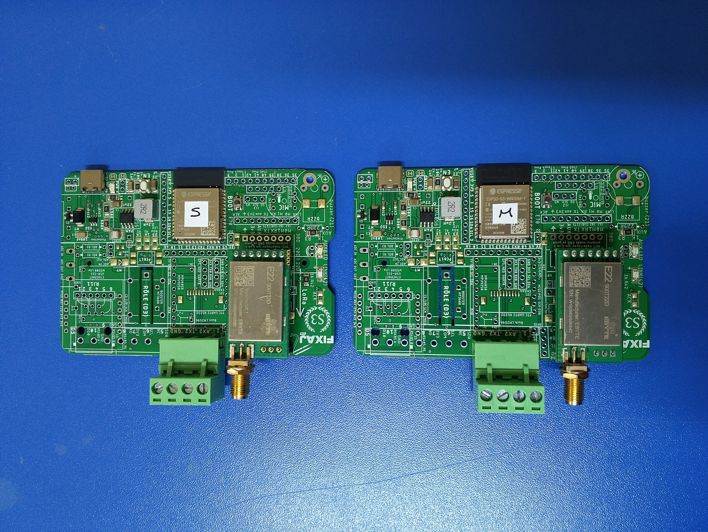
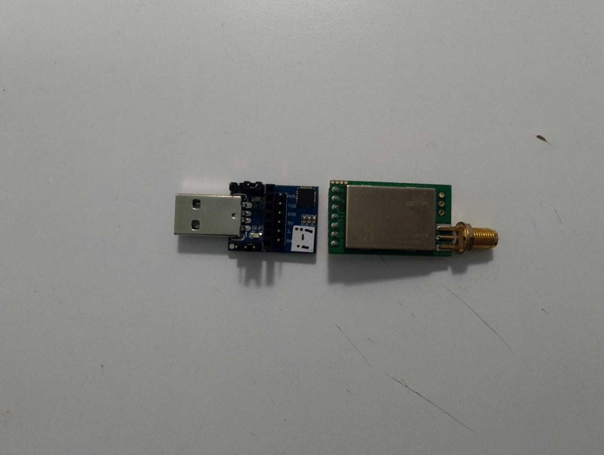

## 📶 `LoRa EBYTE E22900T22D & ESP32-S3 Transceiver`

<br>

<div align="center">
<h3>⚡LoRa ESP32-S3 Shield </h3>

</div>

<br>

<details>
<summary> 🔶 LoRa USB Stick </summary>

</details>

<br>
<br>

- ✅ LoRa Messaging Application

<br>

Used Technologies in The Project:

[](./datasheet/esp32-s3-wroom-1_wroom-1u_datasheet_en.pdf)
[](https://mosquitto.org/)
[](./datasheet/E22-900T22D_UserManual_EN_v1.3.pdf)
[](https://fixaj.com/s3/)

<br>

> Docker Mosquitto [Usage](https://github.com/furkankayam/mqtt-broker-allow-anonymous)

<br>

##### ⚙️ WiFi and MQTT Settings

```ino
const char* WiFi_SSID = "<WIFI_NAME>";
const char* WiFi_PASS = "<WIFI_PASSWORD>";
const char* MQTT_SERVER = "<MQTT_SERVER_IP>";
const char* MQTT_CLIENT_ID = "route";
const char* MQTT_SUB_TOPIC = "route_subscribe";
```

<br>

# License

This project is licensed under the MIT License. See the [LICENSE](LICENSE) file for details
